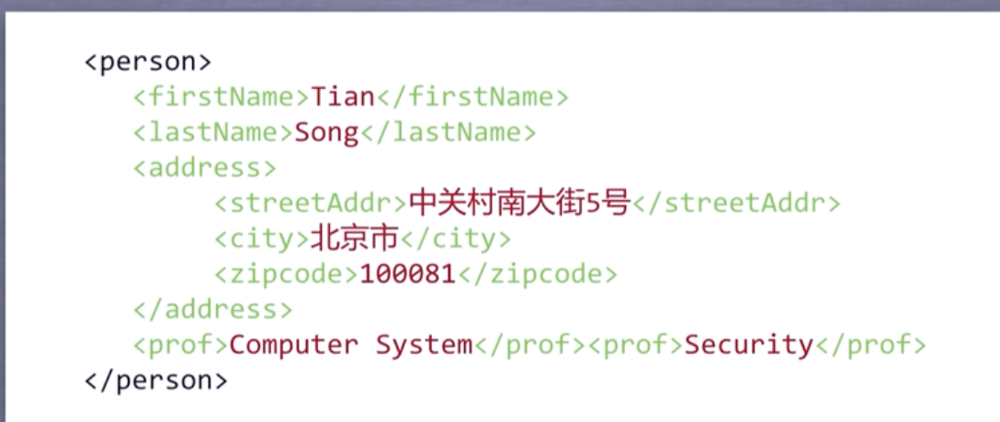
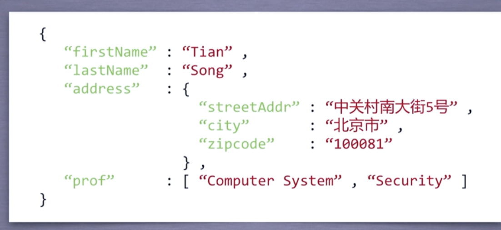
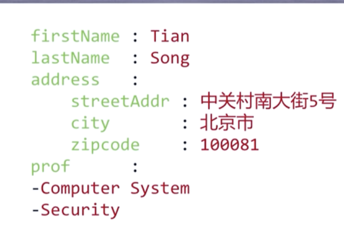

### 信息标记

- 通过预定义的`<>`,`</>`来进行标记
- 现在国际公认的信息标记语言：
  - XML：以标签为主构建信息
  - JSON：JavaScriptObjectNotation，用键值对标记
  - YAML：YAML Ain't Markup Language，无类型键值对，使用缩进表达所属的相关关系。`|`表示整块数据，`#`表示注释，`-`表示并列的值信息。允许嵌套。

- XML实例：
- JSON实例：
- YAML实例：

### 信息提取的一般方法

1. 完整解析标记形式之后解析
2. 无视标记形式，直接搜索关键信息
3. 融合前两种方法

**[实例：提取html中所有的URL链接](./extractUrl.py)**